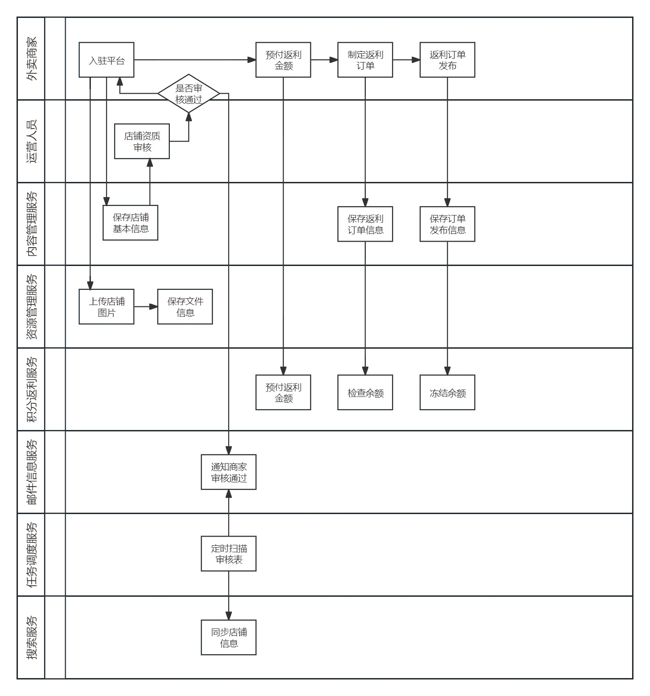
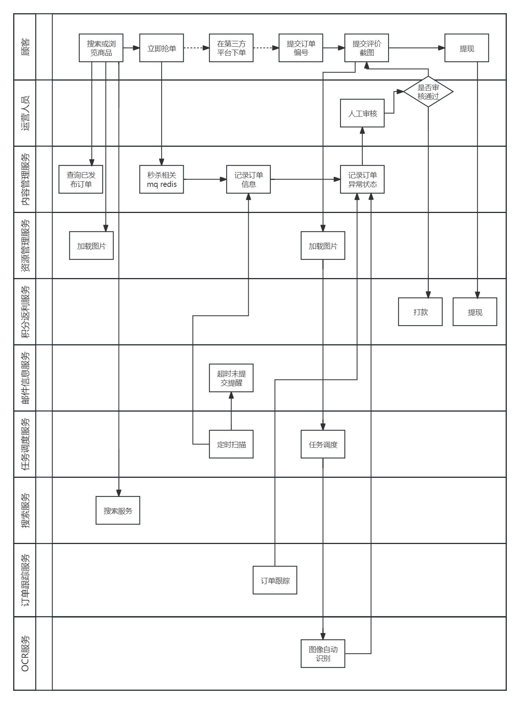

# 1. 项目背景

随着生活节奏加快和消费习惯的变化，外卖市场呈现出持续增长的趋势。用户更加注重方便、快捷的用餐方式，外卖服务满足了这一需求。随着移动支付的普及，用户更加愿意使用手机进行支付，外卖服务的线上支付渗透率逐渐提高。消费者在选择外卖服务时更加关注价格和优惠活动，返利作为一种吸引用户的手段逐渐受到重视。

本项目是本公司自研的一个专门针对外卖服务的返利平台系统，网站旨在提供用户返利和优惠服务，涵盖了各类外卖服务，包括餐厅美食、外卖商户等。项目基于B2C和C2C的业务模式，外卖商户可以在平台注册入驻，发布返利和优惠活动，运营人员对发布的活动进行审核，审核通过后活动才可以在平台上生效，用户可以在平台浏览和选择感兴趣的返利活动。

通过B2C和C2C的结合，该返利平台旨在促进外卖服务商户的业务发展，同时提供给用户更多的返利和优惠选择，从而达到提高用户黏性和平台活跃度的目的。

**什么是B2B2C？**

B2B2C是一种电子商务类型的网络购物商业模式，B是Business的简称，C是Consumer的简称，第一个B指的是商品或服务的供应商，第二个B指的是从事电子商务的企业，C则是表示消费者。

B2B的定义：企业跟企业之间的电子商务运作方式。

B2C的定义：企业跟消费者之间的电子商务运作方式。

**To B 市场**

商户合作机会： 外卖返利平台可以与外卖服务商、餐厅等建立合作关系，提供推广渠道和用户引流，帮助商户增加曝光和订单量。

数据分析和服务优化： 通过与商户合作，外卖返利平台可以获取订单数据和用户行为信息，进行数据分析，帮助商户优化服务、调整营销策略。

返利规则定制： 外卖返利平台可以与商户共同制定返利规则，根据不同商户的需求和营销策略，提供个性化的返利方案。

**To C 市场**

用户吸引和黏性提升： 提供返利服务可以吸引用户在平台上进行消费，同时返利作为一种奖励机制可以增加用户对平台的黏性。

社交推广和邀请机制： 通过推广和邀请机制，用户可以通过邀请朋友注册并使用平台获得额外的返利，形成用户之间的社交互动。

个性化推荐和优惠： 基于用户历史消费数据，外卖返利平台可以提供个性化的推荐服务和定制化的优惠活动，提高用户体验和满意度。

# 2. 项目整体介绍

## 2.1. 项目介绍

本项目包括用户端、商家端、运营端。

核心模块包括：内容管理、资源管理、搜索模块、订单模块、订单跟踪、积分返利、认证授权等。

本项目采用前后端分离架构，后端采用SpringBoot、SpringCloud技术栈开发，数据库使用了MySQL。还使用了Redis、消息队列、分布式文件系统、Elasticsearch等中间件系统。

划分的微服务包括：内容管理服务、资源管理服务、搜索服务、订单服务、订单跟踪服务、积分返利服务、系统管理服务、认证授权服务、网关服务等。

## 2.2. 业务流程

店铺视角的业务流程及涉及到的微服务大致如下图所示：

顾客视角业务流程及涉及到的微服务大致如下：

## 2.3. 整体架构

项目采用了Docker进行环境搭建和部署，

利用**Nacos**、**Xxl-job**、**RabbitMQ**、**MySQL**、**Redis**、**Elasticsearch**等组件来构建微服务体系。

**Jenkins**负责项目流水线，将微服务编译为Docker镜像，然后上传至Docker私服并完成部署。

微服务包括如下：

父工程模块 ginger-cat-parent

基础工程模块 ginger-cat-base

系统模块 ginger-cat-system

网关模块 ginger-cat-gateway

认证授权模块 ginger-cat-auth

内容管理模块 ginger-cat-content

资源管理模块 ginger-cat-resource

邮件信息模块 ginger-cat-mail

搜索模块 ginger-cat-search

订单模块 ginger-cat-order

订单跟踪模块 ginger-cat-track

积分返利模块 ginger-cat-rebate

图像识别模块 ginger-cat-recognition

# 3. 服务介绍

## 3.1. ginger-cat-parent 模块

**依赖管理：** 父工程可以集中管理所有子工程的依赖版本。这样，如果需要升级某个库或框架的版本，只需在父工程中修改一次，所有子工程将继承这个变更，确保它们使用相同的依赖版本，避免版本冲突。

## 3.2. **ginger-cat-base 模块**

- **职责：** 提供通用的基础功能，如工具类、异常处理、公共模型等。
- **数据模型：** 公共的基础模型，如通用响应格式、异常类等。
- **服务提供的接口：** 通用工具类、异常处理。

## 3.3. **ginger-cat-system 模块**

- **职责：** 管理数据字典。
- **技术栈：** Spring Boot。
- **服务提供的接口：** 查询数据字典。

## 3.4. **ginger-cat-gateway 模块**

- **职责：** 提供API网关服务，管理和外部请求路由、认证（而非鉴权）。
- **技术栈：** Spring Cloud、Gateway、Ribben。
- **服务提供的接口：** 无

## 3.5. **ginger-cat-auth 模块**

- **职责：** 处理用户认证和授权相关功能。
- **技术栈：** Spring Boot、Spring Security、JWT。
- **服务提供的接口：** 

## 3.6. **ginger-cat-content 模块**

- **职责：** 保存店铺基本信息、返利订单信息、订单状态等内容，并实现秒杀相关逻辑。
- **技术栈：** Spring Boot、Spring Data JPA。
- **服务提供的接口：** 

## 3.7. **ginger-cat-resource 模块**

- **职责：** 管理系统资源，如图片、文件等。
- **技术栈：** Spring Boot、MinIO。
- **服务提供的接口：** 

## 3.8. **ginger-cat-mail 模块**

- **职责：** 管理系统资源，如图片、文件等。
- **技术栈：** Spring Boot、MinIO。
- **服务提供的接口：** 

## 3.9. **ginger-cat-search 模块**

- **职责：** 管理系统资源，如图片、文件等。
- **技术栈：** Spring Boot、MinIO。
- **服务提供的接口：** 

## 3.10. **ginger-cat-order 模块**

- **职责：** 管理订单的生成和支付。
- **技术栈：** Spring Boot、Spring Data JPA。
- **服务提供的接口：**

## 3.11. **ginger-cat-track 模块**

- **职责：** 提供订单状态追踪功能。
- **技术栈：** Spring Boot、Spring Data JPA。
- **服务提供的接口：** 

## 3.12. **ginger-cat-rebate 模块**

- **职责：** 计算和管理用户的积分返利。
- **技术栈：** Spring Boot、Spring Data JPA、Redis。
- **服务提供的接口：**

## 3.13. **ginger-cat-recognition 模块**

- **职责：** 管理系统资源，如图片、文件等。
- **技术栈：** Spring Boot、MinIO。
- **服务提供的接口：** 

# 4. 项目亮点

**消息队列：**

支付部分

秒杀部分

**定时任务调度：**

商家入驻审核通过后，定时调度器负责调度爬取页面信息建立索引任务

顾客抢单后，定时调度器定时扫描顾客订单并对即将超时订单进行提醒

提交评价截图后，定时调度器负责调度图像识别服务进行自动检测

**缓存：**

秒杀部分

三天内限抢一单

**索引：**

爬取相关店铺页面信息，建立倒排索引用于搜索

**秒杀：**

到点抢单，一定时间后转为普通类型（可以这样实现吗?）

