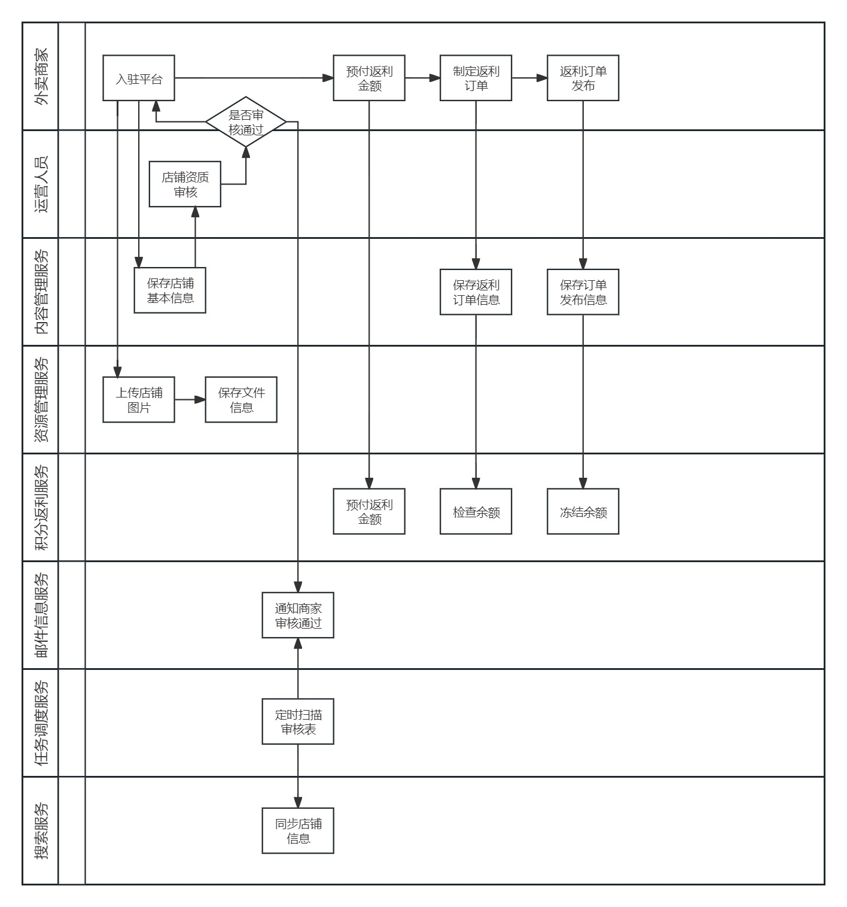
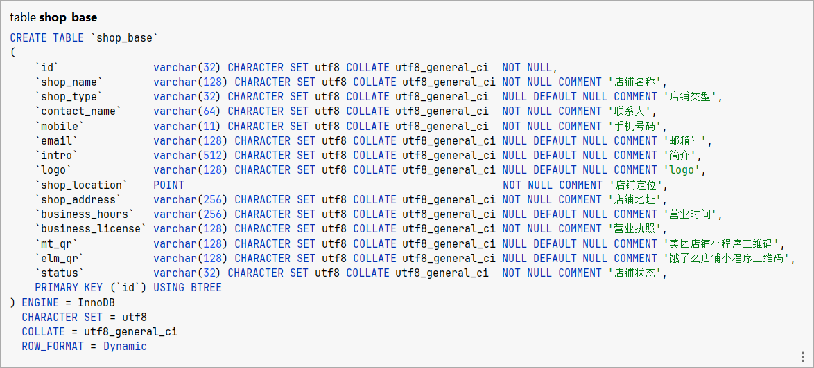
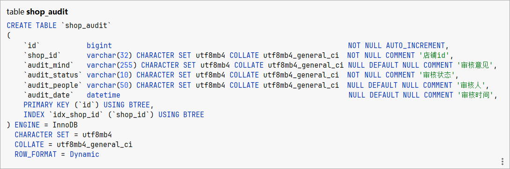
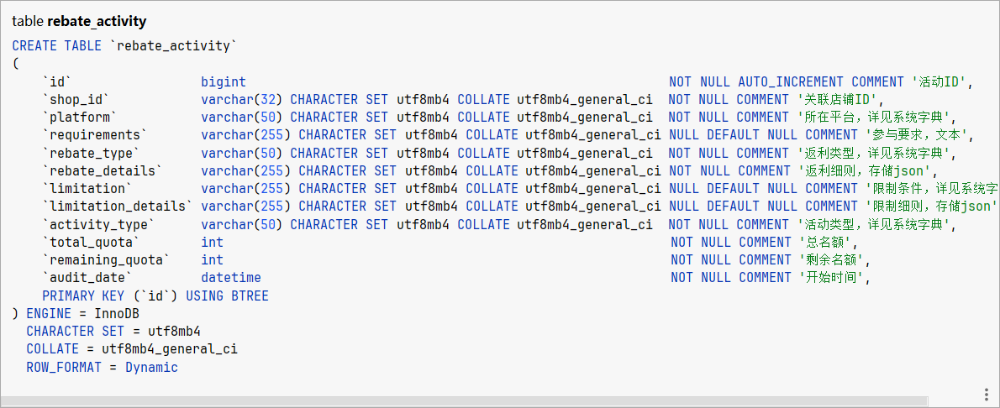
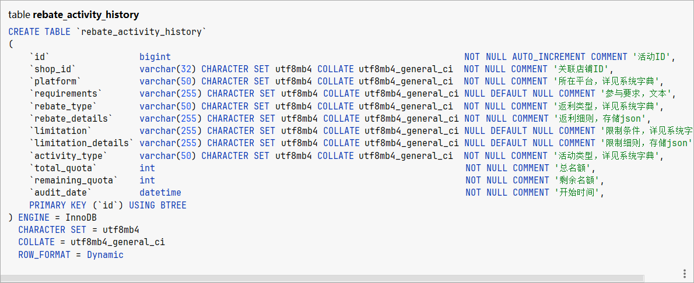

# 橘猫霸王餐 内容管理模块

## 1. 模块需求分析

### 1.1. 模块介绍

内容管理系统（content management system，CMS），是一种位于WEB前端（Web 服务器）和后端办公系统或流程（内容创作、编辑）之间的软件系统。内容的创作人员、编辑人员、发布人员使用内容管理系统来提交、修改、审批、发布内容。这里指的“内容”可能包括文件、表格、图片、数据库中的数据甚至视频等一切你想要发布到Internet、Intranet以及Extranet网站的信息。

本项目作为一个外卖返利平台，其内容管理模块主要对**返利活动及相关内容进行管理**，包括：店铺的基本信息、店铺图片、店铺的返利计划等内容的管理。

### 1.2. 业务流程

内容管理由店铺管理员和平台运营人员共同完成。

店铺管理员的业务流程如下：

* 入驻平台，添加店铺。需要编辑店铺的基本信息、上传店铺图片等内容。需审核。
* 预付返利金额
* 制定返利策略，生成返利订单。
* 发布返利订单。

运营人员的业务流程如下：

* 查询待审核的店铺信息。
* 审核店铺信息。
* 提交审核结果。

下图是整体流程：

### 1.3. 数据模型

店铺基本信息表

店铺审核信息表

返利活动表

返利活动历史表（与返利活动表一致）

