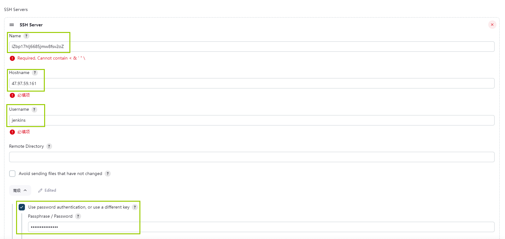
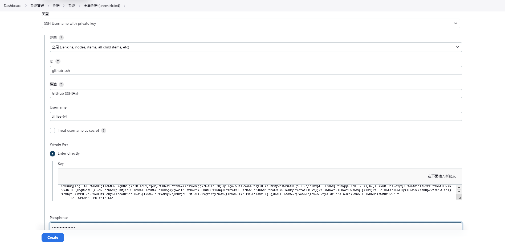
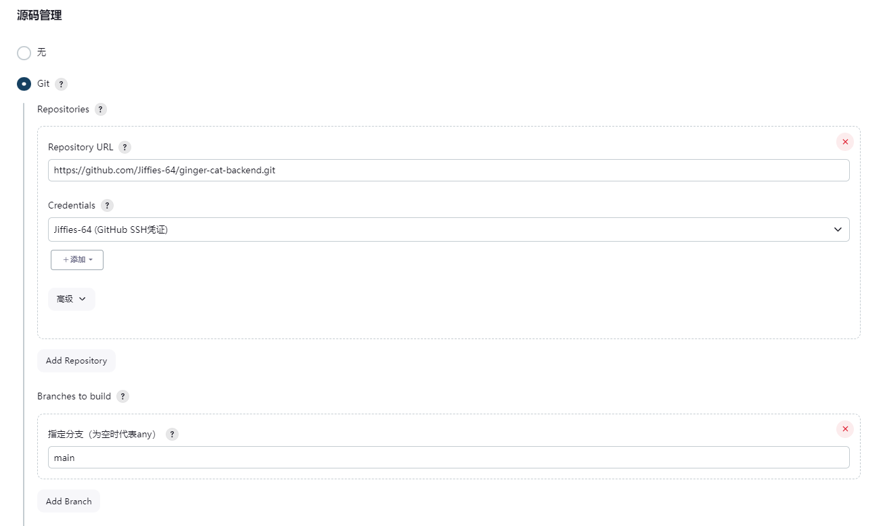
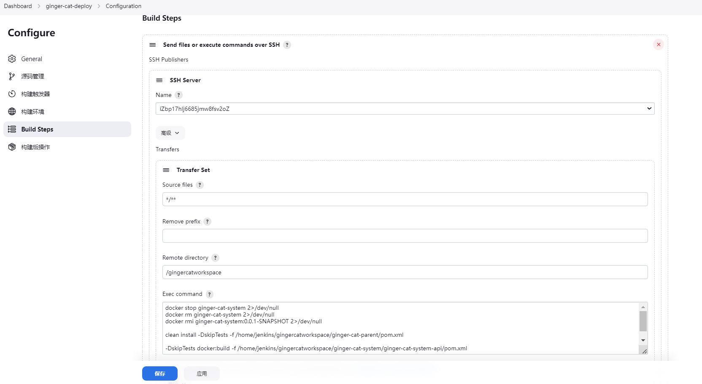

安装JDK 8和Docker通常需要在服务器上执行一系列步骤。以下是在Ubuntu操作系统上安装JDK 8和Docker的简要指南。请注意，具体步骤可能会因操作系统版本和服务器配置而有所不同。

### 安装JDK 8：

1. 更新包列表：

```bash
sudo apt update
```

2. 安装JDK 8：

```bash
sudo apt install openjdk-8-jdk
```

3. 验证安装：

```bash
java -version
```

确保输出显示为Java 8的版本信息。

### 安装Docker：

1. 移除旧版本的Docker（如果有的话）：

```bash
sudo apt remove docker docker-engine docker.io containerd runc
```

2. 安装Docker依赖：

```bash
sudo apt install apt-transport-https ca-certificates curl software-properties-common
```

3. 添加Docker GPG密钥：

```bash
curl -fsSL https://download.docker.com/linux/ubuntu/gpg | sudo gpg --dearmor -o /usr/share/keyrings/docker-archive-keyring.gpg
```

4. 设置稳定版Docker存储库：

```bash
echo "deb [signed-by=/usr/share/keyrings/docker-archive-keyring.gpg] https://download.docker.com/linux/ubuntu $(lsb_release -cs) stable" | sudo tee /etc/apt/sources.list.d/docker.list > /dev/null
```

5. 更新包列表：

```bash
sudo apt update
```

6. 安装Docker：

```bash
sudo apt install docker-ce docker-ce-cli containerd.io
```

7. 验证Docker安装：

```bash
sudo docker --version
```

确保输出显示Docker的版本信息。

8. 将当前用户添加到docker组，以便无需使用sudo运行Docker命令：

```bash
sudo usermod -aG docker $USER
```

注销并重新登录以使更改生效。

现在，您的服务器上应该已成功安装JDK 8和Docker。请注意，具体步骤可能因操作系统版本和要安装的软件包版本而有所不同。如果使用其他操作系统，可以参考相关文档以获取适当的安装指南。

9. 配置docker私服

```
sudo vim /etc/docker/daemon.json
```

添加如下内容:

```json
{
    "hosts": ["tcp://0.0.0.0:2375", "unix:///var/run/docker.sock"],
    "insecure-registries": ["127.0.0.1:5000"]
}
```

这时会发现docker无法启动

```sh
# 使用该命令查看当前docker配置
systemctl cat docker | grep Exec
# 使用该命令修改配置
systemctl edit docker
# 添加如下内容
[Service]
ExecStart=
ExecStart=/usr/bin/dockerd
```

启动docker：

```sh
sudo systemctl restart docker
sudo systemctl start docker
```

### 搭建Nacos：

Nacos（Distributed Naming and Configuration Service）是一个用于动态配置管理和服务发现的开源平台。以下是使用Docker搭建Nacos的简要步骤：

1. **拉取Nacos镜像**：

   打开终端并运行以下命令：

   ```bash
   docker pull nacos/nacos-server
   ```

2. **创建Nacos容器**：

   运行以下命令创建并启动Nacos容器：

   ```bash
   docker run --name nacos-server -p 8848:8848 -e MODE=standalone -d nacos/nacos-server
   ```

   - `--name nacos-server`: 为容器指定名称，可以根据需要更改。
   - `-p 8848:8848`: 将Nacos的默认端口映射到宿主机的端口，可以根据需要更改宿主机端口。
   - `-e MODE=standalone`: 设置Nacos为单机模式，也可以根据需要更改为集群模式。

3. **访问Nacos控制台**：

   打开浏览器并访问 [http://localhost:8848/nacos](http://localhost:8848/nacos)。

   默认的用户名和密码是`nacos`/`nacos`。请注意，这些默认凭据仅适用于开发和测试环境。在生产环境中，请根据安全最佳实践更改默认凭据。

现在，您已经成功在Docker上搭建了一个单机模式的Nacos服务。如果需要搭建Nacos的集群模式，可以通过在`-e MODE=standalone`参数中设置集群配置来进行配置。

请注意，这里提供的是一个简单的演示方法，对于生产环境，您可能需要根据实际需求进行更详细的配置和安全设置。

### 搭建MySQL：

要使用Docker搭建MySQL，您可以按照以下步骤操作：

1. **拉取MySQL镜像**：

   打开终端并运行以下命令：

   ```bash
   docker pull mysql:latest
   ```

   这将下载最新版本的MySQL镜像。

2. **创建MySQL容器**：

   运行以下命令创建并启动MySQL容器：

   ```bash
   docker run --name mysql -e MYSQL_ROOT_PASSWORD=StayDetermined! -p 3306:3306 -d mysql:latest
   ```

   - `--name mysql-container`: 为容器指定名称，可以根据需要更改。
   - `-e MYSQL_ROOT_PASSWORD=your_password`: 设置MySQL的root用户密码，请将 `your_password` 替换为您选择的密码。
   - `-p 3306:3306`: 将MySQL默认端口映射到宿主机的端口，可以根据需要更改宿主机端口。

3. **验证MySQL容器是否运行**：

   ```bash
   docker ps
   ```

   您应该看到MySQL容器在运行中。

4. **连接到MySQL容器**：

   使用MySQL客户端连接到MySQL容器：

   ```bash
   docker exec -it mysql-container mysql -uroot -p
   ```

   然后输入之前设置的root密码。

现在，您已经成功在Docker上搭建了一个MySQL容器。请注意，这只是一个简单的示例，实际生产环境中可能需要更多的配置和安全设置。确保根据实际需求修改密码、配置和其他设置。

### 搭建Jenkins：

要使用Docker搭建Jenkins，您可以按照以下步骤进行操作：

1. **拉取Jenkins镜像**：

   打开终端并运行以下命令：

   ```bash
   docker pull jenkins/jenkins:lts
   ```

   这将下载Jenkins的LTS（Long-Term Support）版本镜像。

2. **创建数据卷**

   ```
docker volume create jenkins-data
   ```
   
3. **创建Jenkins容器**：

   运行以下命令创建并启动Jenkins容器：

   ```bash
   docker run -v jenkins-data:/var/jenkins_home --name jenkins -p 8080:8080 -p 50000:50000 -d jenkins/jenkins:lts
   ```

   - `--name jenkins-container`: 为容器指定名称，可以根据需要更改。
   - `-p 8080:8080`: 将Jenkins web界面的默认端口映射到宿主机的端口，可以根据需要更改宿主机端口。
   - `-p 50000:50000`: 用于Jenkins Agent的端口，可以根据需要更改。
   - `-v jenkins-data:/var/jenkins_home`: 将Jenkins的数据目录挂载到宿主机的卷中，确保数据持久性。

4. **获取Jenkins初始密码**：

   运行以下命令获取Jenkins初始密码：

   ```bash
   docker exec jenkins cat /var/jenkins_home/secrets/initialAdminPassword
   ```

   复制输出的初始密码。

5. **访问Jenkins控制台**：

   打开浏览器并访问 [http://localhost:8080](http://localhost:8080)。

   输入上一步获取的初始密码，按照屏幕上的指示完成Jenkins的初始化设置。

现在，您已经成功在Docker上搭建了一个Jenkins容器。请注意，Jenkins会提示您安装插件和创建管理员用户，根据需要进行配置。此外，确保在生产环境中加强安全设置，如访问控制和身份验证。

### 在Linux上创建用户并生成SSH密钥：

1. **创建用户：**

   ```
   sudo adduser jenkins
   ```

   （将 `<username>` 替换为你想要创建的用户名）

2. **将用户添加到sudo组（如果需要）：**

   ```
   sudo usermod -aG sudo <username>
   ```

   （将 `<username>` 替换为你创建的用户名）

3. **切换到新用户：**

   ```
   su - <username>
   ```

   （将 `<username>` 替换为你创建的用户名）

4. **生成SSH密钥：**

   ```
   ssh-keygen -t rsa -b 4096 -C "your_email@example.com"
   ```

   在这个命令中，`your_email@example.com` 应该替换为你的电子邮件地址。按照提示输入文件名或直接按 Enter 使用默认文件名。

   生成的密钥对将分别保存在 `~/.ssh/id_rsa`（私钥）和 `~/.ssh/id_rsa.pub`（公钥）。

5. **设置SSH密钥：**

   ```
   ssh-copy-id <username>@<server_ip>
   ```

   这会将你的公钥添加到用户的 `~/.ssh/authorized_keys` 文件中。确保将 `<username>` 替换为你的用户名，`<server_ip>` 替换为你的服务器IP地址。

### 新建 Docker Registry 容器：

要新建 Docker Registry 容器，你可以使用以下步骤：

1. **下载 Docker Registry 镜像：**

   首先，从 Docker Hub 下载 Docker Registry 镜像。你可以使用以下命令：

   ```bash
   docker pull registry:latest
   ```

   这将下载最新版本的 Docker Registry 镜像到本地。

2. **创建 Docker Registry 容器：**

   使用以下命令创建一个 Docker Registry 容器：

   ```bash
   docker run -d -p 5000:5000 --restart=always --name registry registry:latest
   ```

   - `-d`: 后台运行容器。
   - `-p 5000:5000`: 将本地端口 5000 映射到容器内的端口 5000。
   - `--restart=always`: 容器在退出时自动重新启动。
   - `--name your-registry`: 为容器指定一个名称，你可以替换为你喜欢的名称。
   - `registry:latest`: 使用最新版本的 Docker Registry 镜像。

3. **验证 Docker Registry 容器是否运行：**

   使用以下命令检查 Docker Registry 容器是否正常运行：

   ```bash
   docker ps
   ```

   如果一切正常，你应该看到一个名为 `your-registry` 的容器正在运行。

现在，你已经成功创建了一个运行 Docker Registry 的容器，并可以使用该 Registry 存储和管理 Docker 镜像。请注意，上述命令中的端口可以根据你的需求进行更改。确保你的 Docker 客户端能够访问所配置的端口。

### Jenkins 配置：

1. **安装插件Publish Over SSH并完成配置**

   

2. **新增凭证**

   

3. **新增任务**

   

```sh
# 清除容器及镜像
docker stop ginger-cat-system-api 2>/dev/null || true
docker rm ginger-cat-system-api 2>/dev/null || true
docker rmi 127.0.0.1:5000/ginger-cat-system-api:0.0.1-SNAPSHOT 2>/dev/null || true
docker stop ginger-cat-gateway 2>/dev/null  || true
docker rm ginger-cat-gateway 2>/dev/null || true
docker rmi 127.0.0.1:5000/ginger-cat-gateway:0.0.1-SNAPSHOT 2>/dev/null || true

# 编译项目
mvn clean install -DskipTests -f /home/jenkins/gingercatworkspace/ginger-cat-parent/pom.xml

# 编译新镜像并上传至私服
mvn -DskipTests docker:build -f /home/jenkins/gingercatworkspace/ginger-cat-system/ginger-cat-system-api/pom.xml
mvn -DskipTests docker:build -f /home/jenkins/gingercatworkspace/ginger-cat-gateway/pom.xml

# 启动新镜像
docker run --name ginger-cat-system-api -p 63110:63110 -idt 127.0.0.1:5000/ginger-cat-system-api:0.0.1-SNAPSHOT
docker run --name ginger-cat-gateway -p 63010:63010 -idt 127.0.0.1:5000/ginger-cat-gateway:0.0.1-SNAPSHOT
```

### 配置禁用密码登录服务器：

在 SSH 服务器上启用密码身份验证（`PasswordAuthentication`）的设置通常在 SSH 服务器的配置文件中进行。默认情况下，大多数 Linux 发行版上的 SSH 服务器配置文件是 `/etc/ssh/sshd_config`。

您可以通过以下步骤在 SSH 服务器上启用密码身份验证：

1. 打开 SSH 服务器的配置文件（`sshd_config`）：

   ```bash
   sudo nano /etc/ssh/sshd_config
   ```

   如果您使用其他文本编辑器，可以将 `nano` 替换为您喜欢的编辑器的命令。

2. 在配置文件中找到 `PasswordAuthentication` 行。默认情况下，此行通常被注释掉（以 `#` 开头），表示密码身份验证被禁用。将其解除注释并将值设置为 `yes`：

   ```bash
   PubkeyAuthentication yes
   PasswordAuthentication yes  # 如果您计划禁用密码登录，请确保将密钥添加到 ~/.ssh/authorized_keys 后再将此选项设置为 no
   ```

3. 保存并关闭文件。如果您使用 `nano`，按下 `Ctrl` + `X`，然后按 `Y` 以确认保存，最后按 `Enter`。

4. 重新启动 SSH 服务器以应用更改：

   ```bash
   sudo service ssh restart
   ```

   或者，取决于您的系统，您可以使用以下命令：

   ```bash
   sudo systemctl restart ssh
   ```

现在，SSH 服务器将允许使用密码进行身份验证。请注意，启用密码身份验证会增加系统的安全风险，因此在生产环境中请谨慎使用。在可能的情况下，推荐使用 SSH 密钥进行身份验证以提高安全性。